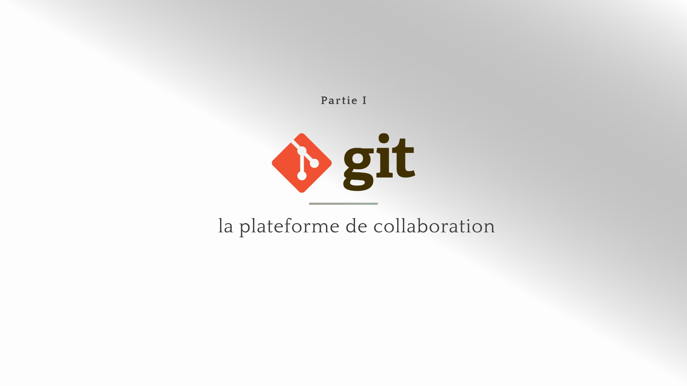
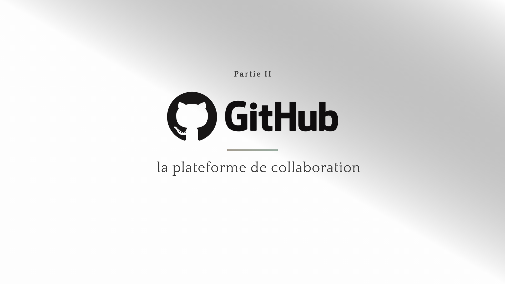
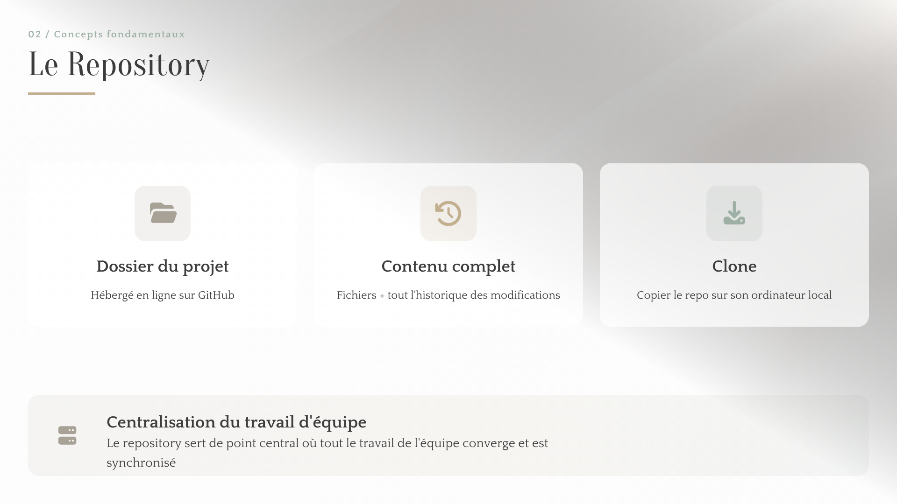
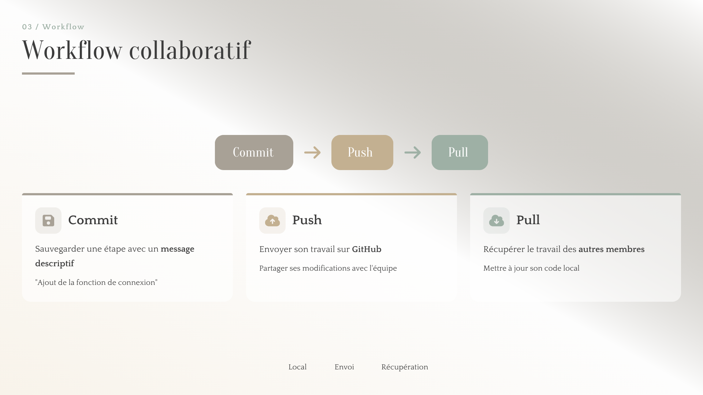
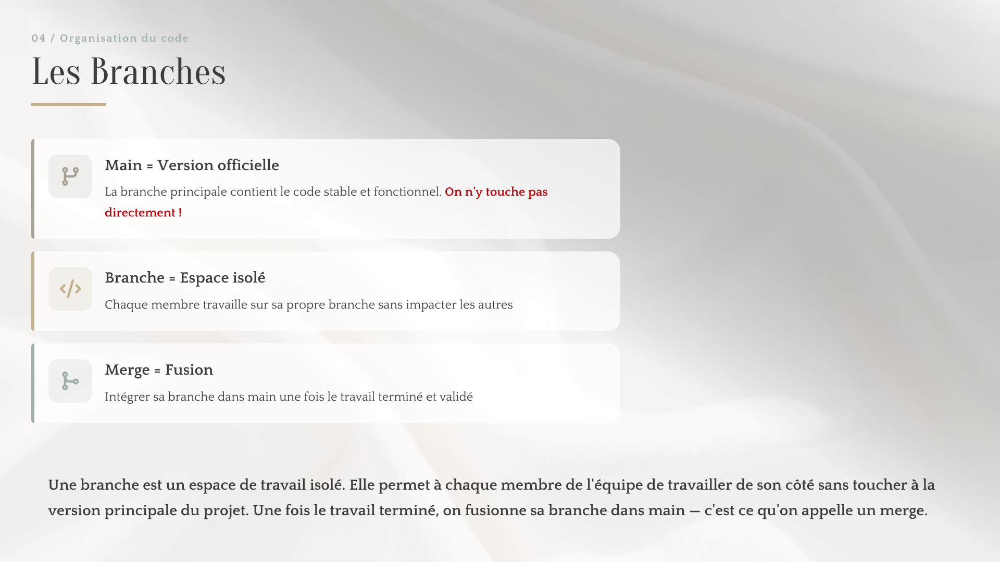
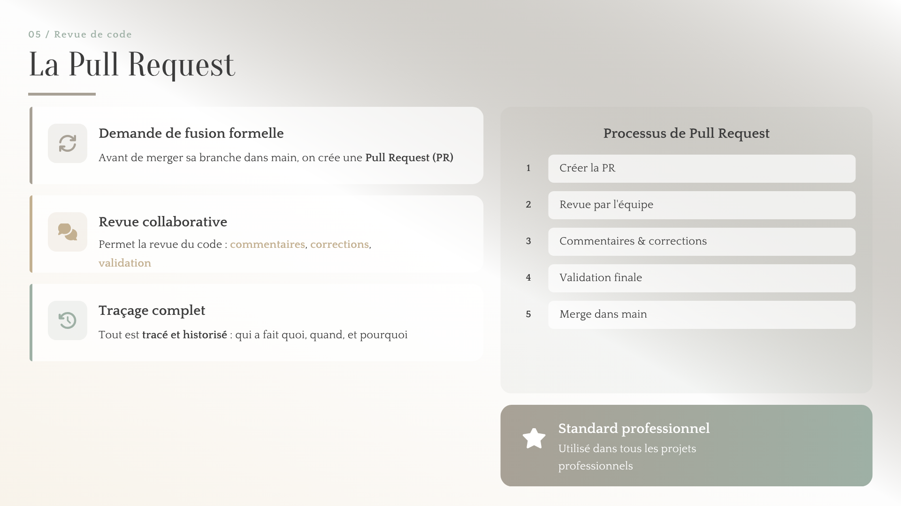
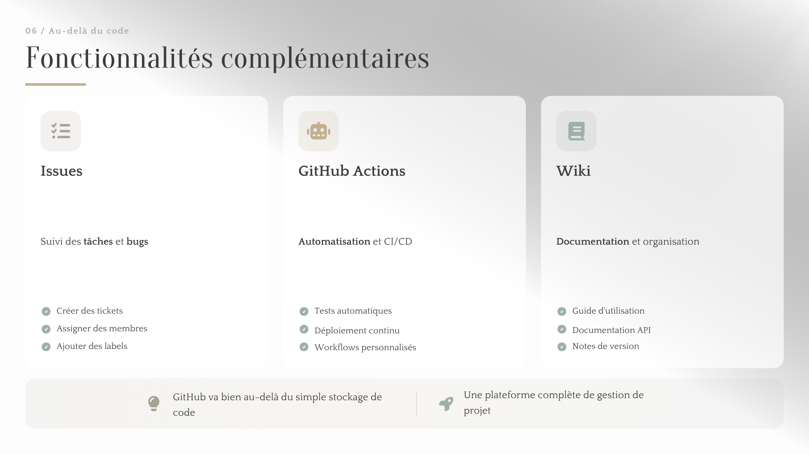

# EXPOSÉ GIT & GITHUB

## Introduction

## Git : l’outil de gestion de versions

## GitHub : la plateforme de collaboration

## Cas pratique

Pour illustrer concrètement le fonctionnement de Git et GitHub, nous avons choisi de créer un repository dédié à notre exposé.
Au lieu de prendre l’exemple d’un site web, nous avons utilisé GitHub pour organiser directement notre travail de groupe. Dans ce repository, nous pouvons regrouper les différents éléments utiles à la préparation de notre présentation, par exemple le texte de l’oral, les idées principales, les captures d’écran, les images, ou encore le contenu du diaporama.
La première étape consiste à créer un repository sur GitHub. Ce repository représente l’espace principal du projet. C’est dans cet espace que l’on stocke tous les fichiers liés à l’exposé. Dans notre cas, il contient par exemple un fichier README.md, qui sert à présenter le sujet, et d’autres fichiers comme des images ou des notes.
Ensuite, une fois le repository créé, on peut ajouter des fichiers. Par exemple, nous avons importé une image de démonstration et modifié le fichier README.md pour y présenter notre exposé sur Git et GitHub. Cela montre que GitHub ne sert pas uniquement à programmer, mais aussi à organiser des documents et du contenu de travail.
Chaque fois qu’une modification est faite, elle peut être enregistrée avec un commit. Le commit correspond à une sauvegarde du projet à un moment précis. Il permet d’ajouter un message explicatif, comme par exemple : ajout de l’image de démonstration, mise à jour du README, ou ajout de la partie cas pratique. Grâce à cela, on garde un historique clair de l’évolution du repository.
Une autre fonction importante est la mise en commun des informations. GitHub permet de centraliser tout le travail au même endroit. Au lieu d’avoir plusieurs versions dispersées sur différents ordinateurs ou dans plusieurs dossiers, toutes les ressources du groupe sont regroupées dans un seul repository accessible en ligne. Cela facilite l’organisation et évite les pertes de documents.
Dans le cadre d’un travail collaboratif, chaque membre peut aussi participer aux modifications. Les changements peuvent être envoyés sur GitHub, récupérés par les autres, puis intégrés au projet. Même dans un usage simple, on retrouve donc les actions essentielles de Git et GitHub : créer un dépôt, ajouter des fichiers, enregistrer les changements, partager le travail et suivre l’évolution du projet.
Ce cas pratique montre donc que GitHub peut être utilisé comme un espace de travail commun pour préparer un exposé. Il permet de stocker les informations, d’ajouter progressivement du contenu, de conserver un historique des modifications et de rendre le projet plus clair et mieux organisé.

## Avantages de Git & GitHub

## Conclusion

